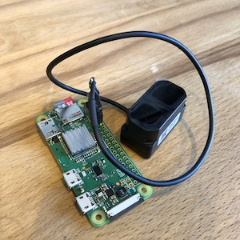

# tfmini-plus
A Node.js library for the TFMini Plus.

This little device can measure long distances and [is reasonably priced](https://amzn.to/2MfTvY8).

The TFMini Plus supports UART and I2C communication. The factory default is UART
and [can be changed programmatically](examples/switch_to_i2c.js).


<br>
(A [tfmini plus](https://amzn.to/2MfTvY8) connected to a [Raspberry Pi Zero W](https://amzn.to/2pF8WBl))<br>


<br>
(An [i2cdriver](https://amzn.to/2onQUTr) controlling an [ssd1327](https://amzn.to/2pEUCZz) display with the measurement)

## BYO[protocol]
Since you can communicate using I2C _or_ UART- I've opted to leave the communication protocol
libraries out to keep from installing extra cruft that isn't needed.

This means **you will need to install the [i2c-bus-promise](https://www.npmjs.com/package/i2c-bus-promise) or
[@serialport/bindings](https://www.npmjs.com/package/@serialport/bindings) independently**.

## Interface

All functions return a Promise.

**DON'T FORGET TO `await` (or use `.then()`)!!**

### I2C(bus, address = 0x10)
Creates an I2C tfminiplus instance.

**bus:** The [i2c-bus-promise](https://www.npmjs.com/package/i2c-bus-promise) instance<br>
**address:** The i2c device address (factory default is `0x10`)

**Returns:** a Promise that resolve with the tfminiplus instance.

To use I2C, you will need to install [i2c-bus](https://www.npmjs.com/package/i2c-bus)
OR [i2c-bus-promise](https://www.npmjs.com/package/i2c-bus-promise)<br>

.. **OR**, for development- Check out an [i2cdriver](https://amzn.to/2onQUTr)!


```
npm install tfmini-plus i2c-bus
```

```js
const tfminiplus = require('tfmini-plus')

tfminiplus.I2C(1, 0x10)
.then(async (tfmp) => {
  const measurements = await tfmp.measure()
  console.log('distance:', measurements.distance)
  console.log('strength:', measurements.strength)
  console.log('temperature:', measurements.temperature)
})
.catch(console.error)
```

... with [i2cdriver](https://www.npmjs.com/package/i2cdriver):
```js
const tfminiplus = require('tfmini-plus')

tfminiplus.I2C('/dev/tty.usbserial-DO010000', 0x10, 'i2cdriver/i2c-bus')
.then(async (tfmp) => {
  console.log('distance:', await tfmp.distance())
})
.catch(console.error)
```

### UART(path, options)
Creates an UART tfminiplus instance.

**path:** The device path<br>
**options:** The [serialport options](https://serialport.io/docs/api-stream#openoptions)

**Returns:** a Promise that resolve with the tfminiplus instance.
To use UART, you will need to install [@serialport/bindings](https://www.npmjs.com/package/@serialport/bindings)
```
npm install tfmini-plus @serialport/bindings
```

```js
const tfminiplus = require('tfmini-plus')
tfminiplus.UART('/dev/serial0', { baudRate: 115200 }).then(async (tfmp) => {
  const measurements = await tfmp.measure()
  console.log('distance:', measurements.distance)
  console.log('strength:', measurements.strength)
  console.log('temperature:', measurements.temperature)
})
.catch(console.error)
```

### The `tfminiplus` instance

#### version()
Returns the device version number (string)

#### measure(unit = '`mm`')
Gets a measurement from the device.

**returns:**
```
{
    distance: number,
    strength: number,
    temperature: number
}
```

#### tfminiplus.distance(unit = '`mm`')
Does the same thing as `measure()`, but only returns the distance (number).

#### tfminiplus.address(addr)
Changes the I2C device address. You must call `save()` to have the setting persist.

#### tfminiplus.save()
Saves the current device settings.

#### tfminiplus.reset()
Resets the device.

#### tfminiplus.restore()
Restores the factory settings.

#### tfminiplus.mode(type='`i2c`')
Sets the mode: `i2c` or `uart`

# References
https://acroname.com/sites/default/files/assets/sj-pm-tfmini_plus_a04_product_mannual_en.pdf

# License
MIT
